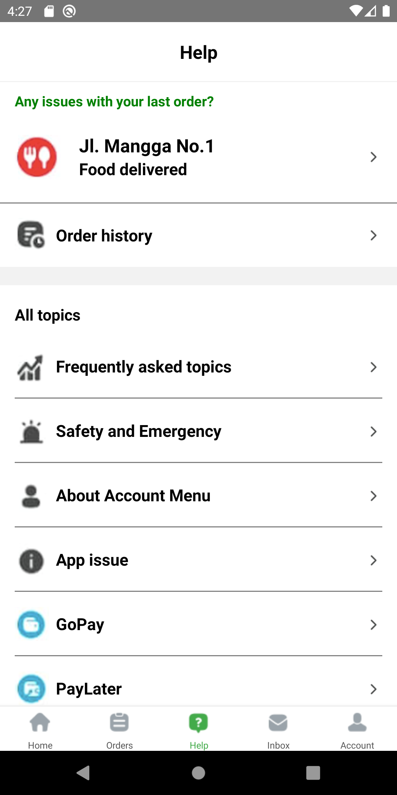

# Cloning Gojek App

Cloning **Gojek App** using React Native.

### Installation:
1. Development Platform
   * [Download Node JS](https://nodejs.org/en/) / [Download Yarn](https://yarnpkg.com/)
   * Android / IOS Simulator
2. Enter project directory 
3. Open the simulator (Android or Ios)
4. Open terminal and type `react-native run-android` or `react-native run-ios`

### Features Demo:

  

Login Screen
 

  

Home Screen
 

  

Orders Screen
 

  

Help Screen
 

  

Inbox Screen
 

  

Account Screen
 

